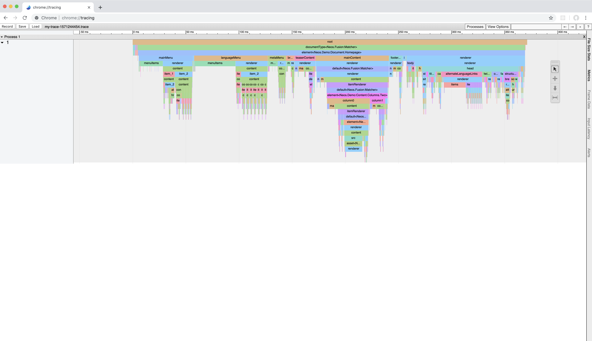

# Flowpack.Fusion.Tracing

**Profile Fusion rendering by creating traces for Trace-Viewer**

## Installation

```
composer require flowpack/fusion-tracing
```

## Usage

* perform requests to Neos with `X-Fusion-Tracing: my-trace-name` header
* or call `Flowpack\Fusion\Tracing\Aspect\RuntimeTracing::enable` explicitly as needed

Traces are written to `FLOW_PATH_DATA/Logs/Traces` in a [Tracer-Viewer](https://github.com/catapult-project/catapult/tree/master/tracing) compatible format.
Open `about:tracing` in Chrome/Chromium and load the generated trace.



## Interpreting the trace

All evaluations in Fusion are traced with the time of beginning and end.
The so called flamegraph visualizes the recursive evaluation of a Fusion rendering.

## License

MIT
